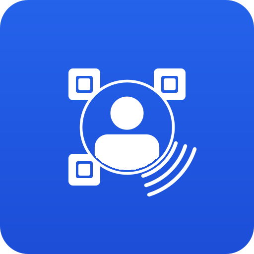

# ShareCard

<p align="center">
  
</p>

<p align="center">
  <strong>A 100% offline, privacy-first Android digital business card and contact-sharing app.</strong><br>
  Share contacts (vCard 3.0), Wi-Fi credentials, URLs, and notes via high-contrast QR codes and physical NFC tags.
</p>

<p align="center">
  <a href="https://github.com/tomstoll/ShareCard/releases/latest">
    
  </a>
  
  
  
</p>

---

## 📥 Download & Install

You don't need the Google Play Store to install ShareCard. It is distributed directly as an open-source APK:

1. **[Download the Latest APK](https://github.com/tomstoll/ShareCard/releases/latest)** onto your Android phone.
2. Tap the downloaded `.apk` file and select **Install**.
   *(If prompted by Android, allow "Install unknown apps" for your browser or file manager. ShareCard requests zero internet permission, so your device remains completely secure).*

---

## 🔒 Privacy Guarantees

- **Zero Internet Access**: `<uses-permission android:name="android.permission.INTERNET" />` is **never declared** in the Android Manifest. The app cannot make network calls, send telemetry, or reach the cloud.
- **Single Permission**: `android.permission.NFC` (classified by Android as a "normal" permission: silently granted at install time with zero permission dialogs).
- **Zero Storage Permissions**: Backups and exports use Android's native Storage Access Framework (SAF) document pickers.
- **No Accounts, No Tracking**: Everything is stored locally on your device in private application sandbox storage.

---

## ✨ Features

- **Multi-Card Carousel**:
  - **Contact Cards (vCard 3.0)**: Name (prefix, first, middle, last, suffix), title, organization, multiple phone numbers, emails, websites, physical addresses, and notes.
  - **Wi-Fi Cards**: Quick-connect QR codes for WPA/WPA2/WPA3 networks with hidden SSID toggle.
  - **Web Links**: Social profiles, portfolios, GitHub, or custom URLs.
  - **Plain Text / Notes**: Freeform notes, instructions, or public keys.
- **Physical NFC Tag Writer**:
  - Write standard NDEF records (`text/vcard` or URI) directly onto blank NTAG213, NTAG215, or NTAG216 tags, keycards, stickers, or rings.
  - Live byte counter informs you whether your card fits on an NTAG213 (144B), NTAG215 (504B), or NTAG216 (888B).
  - Built-in sensor positioning guide with animated alignment visualization.
- **Home Screen Widget (Jetpack Glance)**:
  - Instant translucent QR code overlay with 1-tap 100% brightness boost.
  - Switch active cards directly from your home screen without opening the full editor.
- **Smart Contact Editor**:
  - **1-Tap Profile Autofill**: Autofills your details directly from your personal Android profile.
  - **International Country Code Picker**: Search 200+ countries with dial codes and smart international phone number formatting (E.164).
  - **Flexible International Address Form**: Compatible with standard 2-line street addresses and international multi-line formats (Universal Postal Union S42 & RFC 2426).
- **Themes & Display**:
  - **Material You Dynamic Theming**: Matches your Android 12+ wallpaper palette.
  - **Pure OLED Black (#000000)**: Maximizes contrast and battery savings on AMOLED displays.
  - **Adaptive & Themed App Icons**: Full monochrome icon support for Android 13+.
- **Backup & Portability**:
  - Full application backup & restore (.json) via the native Android Sharesheet and Storage Access Framework.
  - Individual vCard (.vcf) import and export.

---

## 🛠️ Tech Stack & Architecture

- **Language**: Kotlin 2.0
- **UI Framework**: Modern Jetpack Compose with Material 3 design system
- **Home Screen Widget**: AndroidX Glance 1.1.0 with Glance Material 3
- **Architecture**: Unidirectional Data Flow (StateFlow + Compose State)
- **Serialization**: Kotlinx Serialization (zero-reflection, compile-time generated)
- **QR Generation**: ZXing Core (pure offline bitmap generation)
- **Target SDK**: Android 15 (API 35), Minimum SDK: Android 8.0 (API 26)

---

## 🚀 Building From Source

### Prerequisites
- Android Studio Ladybug (or newer)
- Android SDK 35
- JDK 17 or JDK 21

### Local Build
```bash
git clone https://github.com/tomstoll/ShareCard.git
cd ShareCard
./gradlew assembleDebug
```
To install directly to a connected device:
```bash
adb install -r app/build/outputs/apk/debug/app-debug.apk
```

---

## 📄 License

This project is licensed under the [MIT License](LICENSE) - see the [LICENSE](LICENSE) file for details.